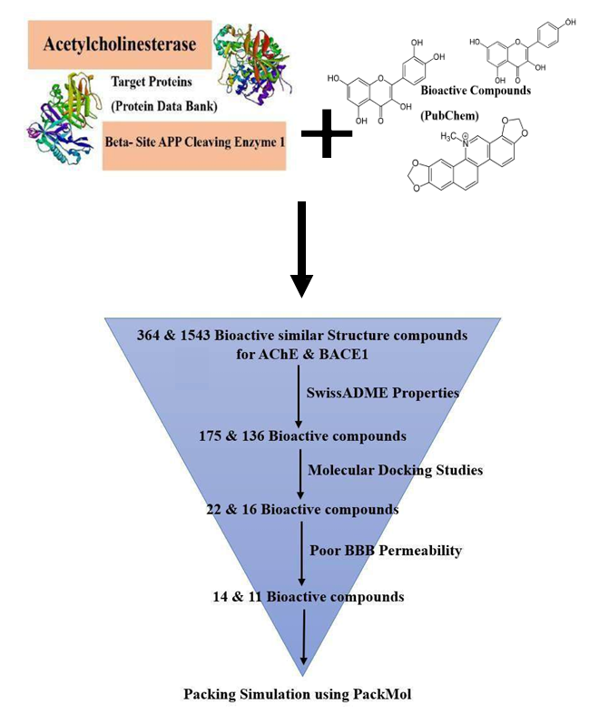
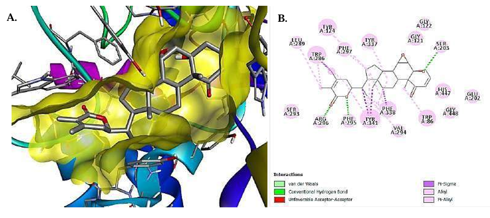
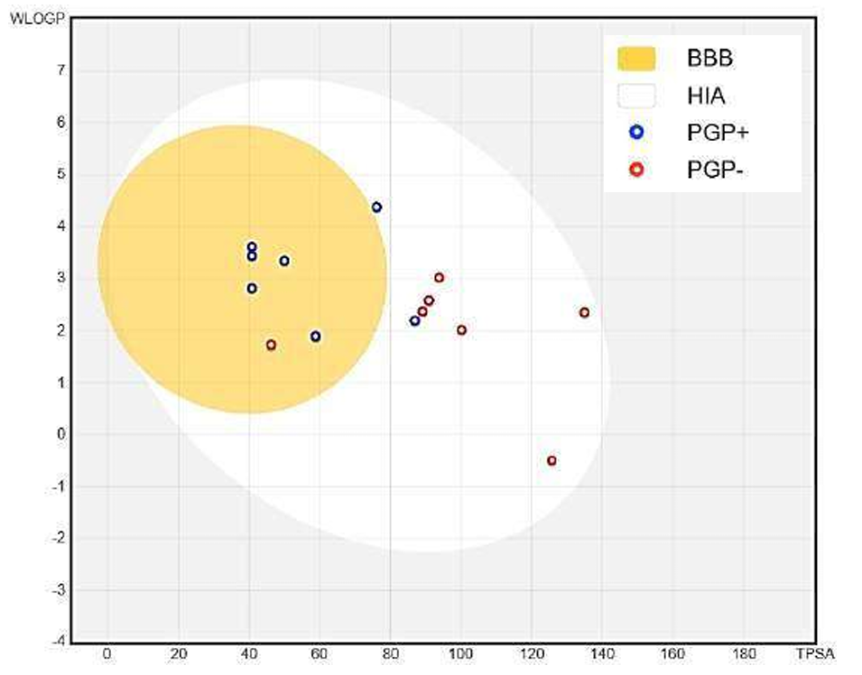

# In-Silico Drug Designing and Delivery for Potential Therapeutic Agents Against Alzheimer’s Disease

   

## 📌 Project Overview
**Author:** Shashank Kashyap   

Alzheimer’s Disease (AD) is a progressive neurodegenerative disorder characterized by cholinergic deficiency and amyloid-beta plaque accumulation. This project employs a **multi-target in-silico approach** to identify novel therapeutic agents that can inhibit two critical enzymes in AD pathology:
1.  **Acetylcholinesterase (AChE):** To improve cholinergic neurotransmission.
2.  **Beta-Secretase 1 (BACE1):** To halt the amyloidogenic pathway.

Furthermore, this study proposes a novel **Nanocarrier Delivery System** (PNIPAM hydrogel) simulation to facilitate the transport of potent but impermeable compounds across the Blood-Brain Barrier (BBB).

---

## 🛠️ Methodology & Workflow

The study utilized a structure-based drug design (SBDD) pipeline:

1.  **Target Selection:** Structures for AChE (PDB: `4EY7`) and BACE1 (PDB: `4XXS`) were retrieved and validated using Ramachandran plots (SAVES v6.1).
2.  **Virtual Screening:** A library of ~1,900 natural compound analogs was generated via **PubChem** based on known neuroprotective agents (e.g., *Bellidifolin, Kaempferol, Baicalein*).
3.  **Pharmacokinetics (ADMET):** Drug-likeness and BBB permeability were assessed using **SwissADME** (Lipinski's Rule of Five).
4.  **Molecular Docking:** Rigid docking was performed using **AutoDock4** to calculate binding energies and analyze Ligand-Protein interactions.
5.  **Delivery Simulation:** Compounds with high affinity but poor BBB permeability were proposed for encapsulation in Poly(N-isopropylacrylamide) hydrogels using **PackMol**.

 
<em>Figure 1: Graphical Abstract illustrating the screening and docking pipeline.</em>

---

## 📊 Key Findings

### 1. Target Validation
Before docking, protein structures were validated to ensure stereochemical quality. The Ramachandran plots confirmed that >90% of residues lay in favorable regions, validating the protein models for simulation.

 
<em>Figure 2: Ramachandran plot validation for AChE.</em>

### 2. Molecular Docking & Interaction Analysis
Out of the screened library, **22 bioactive compounds** for AChE and **16 for BACE1** were identified as top hits. Detailed analysis revealed strong hydrogen bonding and Pi-Pi stacking interactions within the active sites.

| Target | Top Ligand Hit | Binding Energy (kcal/mol) | Key Interactions |
| :--- | :--- | :--- | :--- |
| **AChE** | Withanolide A (Mol 3) | **-13.90** | Arg296, Phe295, His447 |
| **AChE** | Silymarin (Mol 50) | -11.08 | Phe295, Tyr341, Arg296 |
| **BACE1** | Gracilin L (Mol 2) | **-8.87** | Gly230 |
| **BACE1** | Cardamonin (Mol 34) | -7.89 | Ser229, Thr231 |

 
<em>Figure 3: 3D Visualization of ligand binding within the protein active site(Withanolide A-Mol 3).</em>

### 3. Pharmacokinetics & BBB Permeability
The **BOILED-Egg model** was used to distinguish between compounds that can passively cross the Blood-Brain Barrier (Yellow region) and those requiring encapsulation.

 
<em>Figure 4: BOILED-Egg model predicting GI absorption and Brain penetration.</em>

---

## 💡 Therapeutic Implications
This study highlights the potential of **Natural Compound Analogs** as dual-action therapeutics. 
*   **Dual Inhibition:** Targeting both symptoms (AChE) and disease progression (BACE1).
*   **Delivery Strategy:** The proposal to use **PNIPAM hydrogels** addresses the major bottleneck of Alzheimer's drugs—getting large, complex molecules across the Blood-Brain Barrier.

---

## 🔒 Full Report Access
**This repository contains an overview of the analysis and key visualizations.** 

As this is a formal project report submitted for the award of Bachelor of Engineering, the full thesis document is not publicly available in this repository.

**Recruiters & Academic Collaborators:**  
If you wish to review the full project report, detailed docking logs, or discuss the methodology, please contact me directly:

📧 **Email:** kashyapshashank222@gmail.com  
🔗 **LinkedIn:** https://www.linkedin.com/in/shashank-kashyap-805309238/

---

## 📚 Tools & References
*   **Databases:** PDB, PubChem.
*   **Software:** AutoDock4, AutoDock Tools (ADT), SwissADME, PyMOL/Discovery Studio, SAVES Server.
